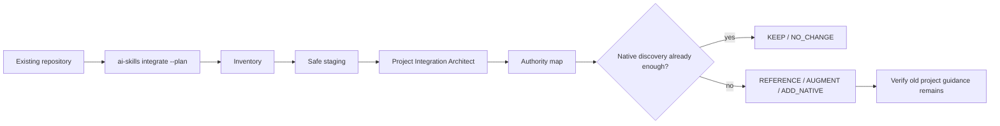
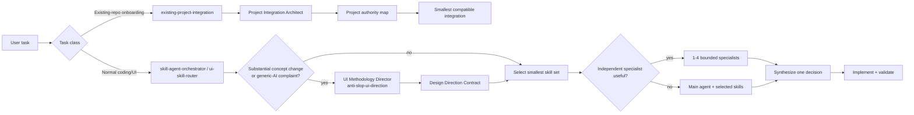
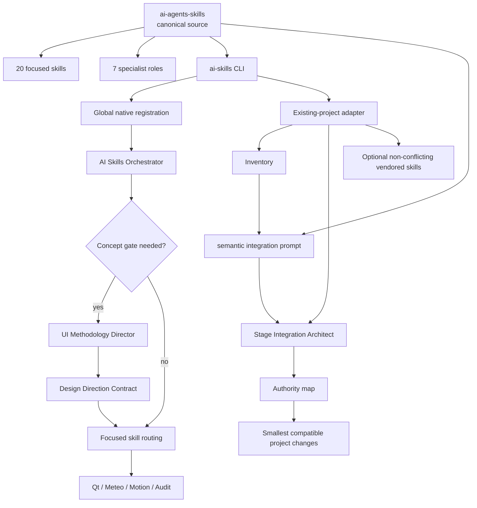

<div align="center">

# AI Agents Skills

**Progressive-disclosure skills, project-first integration, Anti-Slop concept direction and specialist agents for Codex, Claude Code and Google Antigravity**

[](https://github.com/f2re/ai-agents-skills/actions/workflows/validate-skills.yml)
[](https://github.com/f2re/ai-agents-skills/stargazers)
[](https://github.com/f2re/ai-agents-skills/network/members)
[](https://github.com/f2re/ai-agents-skills/commits/main)
[](https://github.com/f2re/ai-agents-skills/issues)


A reusable engineering layer for coding agents: project-aware integration, concept direction, UI/UX contracts, Qt/C++ rules, meteorological workstation patterns, radar timelines, maps, scientific visualization, motion, direct manipulation and evidence-based acceptance.

[Install](#-one-command-install) · [Existing projects](#-smart-existing-project-integration) · [Routing](#-how-orchestration-works) · [Anti-Slop](#-anti-slop-methodology) · [Skills](#-skill-catalog) · [Agents](#-specialist-agents) · [Architecture](#-architecture)

</div>

---

## Why this exists

Coding agents often know how to produce components but not **what interaction concept should organize the user's work**. They tend to jump from a vague request like “make it professional” directly to cards, sidebars, gradients, dropdowns and generic plots. The result can be clean and still be interchangeable with a finance/SaaS dashboard.

There is a second failure mode: reusable agent packs are often integrated into mature repositories by mechanically appending new `AGENTS.md` blocks, generating a fresh `DESIGN.md`, copying every specialist role and overwriting same-name skills. The repository ends up serving the framework instead of the framework serving the repository.

This project handles both problems.

Normal material UI work follows:

**user intent → concept gate → focused skills → optional specialists → implementation → anti-slop regression → acceptance audit**.

Existing-repository onboarding follows:

**inventory → authority map → native discovery → semantic role mapping → smallest compatible merge**.

Skills are discovered by name and description first; full instructions and optional references are loaded only when relevant. A small fix does not pay the cost of a full design ceremony.

The catalog is especially detailed for **native Qt/C++ meteorological software**: radar/satellite time navigation, forecast cycles, map LOD, asynchronous data loading, Qwt/scientific plots, uncertainty, keyboard-first operation and dense-but-readable professional layouts.

## ⚡ One-command install

```bash
curl -fsSL https://raw.githubusercontent.com/f2re/ai-agents-skills/main/install.sh | bash
```

No `sudo` is required. The bootstrap downloads one managed source copy, installs the `ai-skills` CLI and registers global skills/specialists through native discovery mechanisms.

Verify:

```bash
ai-skills doctor
ai-skills status
```

For an existing repository, inspect first:

```bash
ai-skills integrate . --plan
```

Then stage safe project integration:

```bash
ai-skills integrate .
```

The historical `ai-skills project .` command remains a compatibility alias for `integrate`.

Or install globally and stage the current project in one command:

```bash
curl -fsSL https://raw.githubusercontent.com/f2re/ai-agents-skills/main/install.sh | bash -s -- --project .
```

<details>
<summary><strong>Team / vendored skills</strong></summary>

```bash
ai-skills integrate . --vendor
```

This vendors package-managed skills into project discovery locations. A pre-existing project-local same-name skill is preserved and shadows the library version.

</details>

<details>
<summary><strong>Update / uninstall</strong></summary>

```bash
ai-skills update
ai-skills uninstall
```

`uninstall` removes managed **global** registrations and managed global instruction blocks. It does not delete unrelated user/project content.

</details>

## 🧬 Smart existing-project integration

`ai-skills integrate` is deliberately not a “write our template into every config file” command.

### Phase 0 — read-only plan

```bash
ai-skills integrate . --plan
```

The CLI inventories:

- root and nested `AGENTS.md` / `AGENTS.override.md`;
- `CLAUDE.md`, `GEMINI.md`, `DESIGN.md` and common design docs;
- existing `.agents/skills`, `.claude/skills`;
- existing `.codex/agents`, `.claude/agents`, `.agents/agents`;
- scoped `.claude/rules`, `.agents/rules`;
- basic stack/domain signals.

`--plan` performs **zero repository writes**.

### Phase 1 — safe structural staging

```bash
ai-skills integrate .
```

It stages only one temporary onboarding specialist — the **Project Integration Architect** — plus transparent adapter metadata:

```text
project/
├── .codex/agents/project-integration-architect.toml
├── .claude/agents/project-integration-architect.md
├── .agents/agents/project-integration-architect/agent.md
└── .ai-agents-skills/
    ├── README.md
    ├── PROJECT_INVENTORY.md
    └── INTEGRATION_PROMPT.md
```

It does **not** automatically modify:

```text
AGENTS.md
AGENTS.override.md
CLAUDE.md
CLAUDE.local.md
GEMINI.md
DESIGN.md
existing local rules
existing local skills
existing local agents
```

It also does **not** install all library specialists into the repository before inspecting the repository's existing role model.

### Phase 2 — project authority map

The generated `INTEGRATION_PROMPT.md` tells a coding agent to read the existing system first and classify each capability:

| Action | Meaning |
|---|---|
| `KEEP` | Existing project artifact already owns the behavior |
| `REFERENCE` | Keep the owner; add only a pointer if genuinely needed |
| `AUGMENT` | Minimally extend an existing artifact in its own structure/style |
| `ADD_NATIVE` | Add a missing skill/agent/rule through native discovery |
| `SHADOW_LIBRARY` | Preserve a project-local same-name artifact over the package version |
| `NO_CHANGE` | Native discovery already provides the capability; no project-doc edit needed |

Authority order:

```text
explicit project rule/design decision
        > project-local skill/agent/rule
        > reusable package capability
        > inferred preference
```

### Phase 3 — semantic role mapping

If a repository already has `design-reviewer`, the integration architect does not blindly add `ui-ux-auditor` beside it. It first asks whether they are actually separate responsibilities.

Preferred result:

```text
existing design-reviewer
      + selected audit skills
```

not:

```text
design-reviewer
ui-ux-auditor
second-reviewer
second-orchestrator
```

Likewise, existing design memory is extended only when there is a durable project-specific gap. `DESIGN.md` is **not** a registration mechanism.

### Why the prompt is generated instead of hard-coded merging

Filesystem presence can be decided deterministically. Role equivalence, project vocabulary, scoped instructions and architectural authority cannot.

The CLI therefore creates a repository-aware prompt containing:

- detected project surfaces;
- nested instruction scopes;
- local skills/agents/rules;
- available library skill metadata;
- available library roles;
- strict non-destructive integration rules.

Print it without writing anything:

```bash
ai-skills prompt .
```



See [`docs/existing-project-integration.md`](docs/existing-project-integration.md).

## 🧠 How orchestration works

The central rule is **progressive disclosure, not prompt dumping**. Integration and anti-slop are separate gates used only when their task class applies.



Routing rules:

- existing-repository onboarding begins with one integration architect, not a swarm of library roles;
- a small or obvious edit stays with the main agent;
- a single concern activates one focused skill;
- a substantial primary work-surface/information/navigation/visualization redesign runs the concept gate first;
- “looks generic / AI-generated / dashboard-like / slop” is treated as a conceptual signal, not merely a styling request;
- the methodology director is normally sequential; downstream specialists share one accepted concept;
- complex work may use 2–4 independent specialists after project authority/concept direction is coherent;
- overlapping write-heavy agents are avoided.

## 🧭 Anti-Slop methodology

Anti-slop here is **not a visual style**. It is a rejection and handoff system.

Before implementation of a substantial surface, `anti-slop-ui-direction`:

1. states the user's operational question and primary work object;
2. creates three concepts that differ in interaction/information mechanism, not theme/layout;
3. runs four tests: **genericity**, **templateability**, **domain truth**, **implementation reality**;
4. selects one defining mechanism plus at most one or two supports;
5. emits a compact **Design Direction Contract** with invariants, non-goals and downstream routing.

Examples for meteorological software include `TIME IS THE SPINE`, `ATMOSPHERIC COLUMN IS THE OBJECT`, `MODEL DISAGREEMENT IS DATA`, `FACT → NOW → FORECAST`, `MAP ↔ PLOT COUPLING` and `LINKED INSPECTION`.

The genericity test targets the **primary work surface and organizing logic**, not standard controls. A normal `QDialog`, `QTableView`, toolbar or combo box may remain conventional.

See [`docs/anti-slop-methodology.md`](docs/anti-slop-methodology.md) and references under [`anti-slop-ui-direction/references`](.agents/skills/anti-slop-ui-direction/references/).

## 🧩 Skill catalog

Every skill contains explicit when-to-use rules, patterns, anti-patterns and acceptance criteria.

| Area | Skill | What it does |
|---|---|---|
| Integration | [`existing-project-integration`](.agents/skills/existing-project-integration/SKILL.md) | Project-first onboarding, authority mapping, collision handling and minimal semantic merge. |
| Routing | [`skill-agent-orchestrator`](.agents/skills/skill-agent-orchestrator/SKILL.md) | Chooses the smallest relevant skill set and optional specialists. |
| Routing | [`ui-skill-router`](.agents/skills/ui-skill-router/SKILL.md) | Routes focused UI tasks without loading the full catalog. |
| Concept | [`anti-slop-ui-direction`](.agents/skills/anti-slop-ui-direction/SKILL.md) | Concept gate, rejection tests, Design Direction Contract and regression rules. |
| Evidence | [`design-evidence-and-intent`](.agents/skills/design-evidence-and-intent/SKILL.md) | Separates observed evidence, intent, constraints and preference. |
| Flow | [`interaction-contracts-and-flow`](.agents/skills/interaction-contracts-and-flow/SKILL.md) | `intent → trigger → feedback → pending → result → recovery → next action`. |
| Hierarchy | [`information-hierarchy-and-density`](.agents/skills/information-hierarchy-and-density/SKILL.md) | Grouping, spacing, density, hierarchy and progressive disclosure. |
| Qt/C++ | [`qt-cpp-design-system`](.agents/skills/qt-cpp-design-system/SKILL.md) | Native Qt Widgets/QML/C++ design-system rules. |
| Controls | [`dense-controls-and-selection`](.agents/skills/dense-controls-and-selection/SKILL.md) | Combo/search/multi-select/segmented controls and compact toolbars. |
| Workflows | [`workflow-and-progressive-disclosure`](.agents/skills/workflow-and-progressive-disclosure/SKILL.md) | Wizards, import/review flows and staged disclosure. |
| States | [`states-errors-and-recovery`](.agents/skills/states-errors-and-recovery/SKILL.md) | Loading, empty, stale, partial, error, retry and cancel. |
| Safety | [`operator-accessibility-and-safety`](.agents/skills/operator-accessibility-and-safety/SKILL.md) | Keyboard/focus, non-color cues and operator safety. |
| Meteorology | [`meteorologist-workstation-ux`](.agents/skills/meteorologist-workstation-ux/SKILL.md) | Workstation semantics around time, model, source and uncertainty. |
| Radar | [`radar-timeline-and-playback`](.agents/skills/radar-timeline-and-playback/SKILL.md) | Compact radar/satellite/nowcast timeline and per-frame states. |
| Time | [`time-data-navigation`](.agents/skills/time-data-navigation/SKILL.md) | Forecast cycles, valid-time navigation and temporal context. |
| Maps | [`viewport-map-interactions`](.agents/skills/viewport-map-interactions/SKILL.md) | Predictable zoom/pan, semantic LOD and request behavior. |
| Plots | [`meteorological-visualization`](.agents/skills/meteorological-visualization/SKILL.md) | Scientific plots, crosshair, ensembles, aerology and uncertainty. |
| Motion | [`motion-feedback-and-microinteractions`](.agents/skills/motion-feedback-and-microinteractions/SKILL.md) | Purpose/frequency-first motion and interruptibility. |
| Gestures | [`gesture-and-direct-manipulation`](.agents/skills/gesture-and-direct-manipulation/SKILL.md) | Mouse/trackpad/wheel/drag/snap semantics. |
| Acceptance | [`ui-audit-and-acceptance`](.agents/skills/ui-audit-and-acceptance/SKILL.md) | Final evidence-based audit plus concept-regression gate. |

### Example: SLOP → DECENT → PROFESSIONAL radar timeline

**SLOP:** generic slider + global spinner + observed/forecast frames that look identical.

**DECENT:** compact exact timestamps, play/pause and local loading.

**PROFESSIONAL:** `FACT → NOW → FORECAST` is the defining mechanism; provenance is part of the timeline, every frame carries loaded/pending/missing state, the last valid map stays visible during refresh, gaps remain honest and keyboard stepping is immediate.

## 🤖 Specialist agents

Specialists are **compositions**, not copies of the whole skill corpus.

| Agent | Best used for | Definition |
|---|---|---|
| **AI Skills Orchestrator** | Multi-area work; routing, delegation and synthesis | [`agents/ai-skills-orchestrator.md`](agents/ai-skills-orchestrator.md) |
| **Project Integration Architect** | Safe onboarding into an established agent/design system | [`agents/project-integration-architect.md`](agents/project-integration-architect.md) |
| **UI Methodology Director** | Substantial concept direction, anti-slop tests, Design Direction Contract | [`agents/ui-methodology-director.md`](agents/ui-methodology-director.md) |
| **UI/UX Auditor** | Existing-interface evidence, click tax, states, hierarchy and acceptance | [`agents/ui-ux-auditor.md`](agents/ui-ux-auditor.md) |
| **Qt Interface Designer** | Native Qt/C++ architecture and implementation | [`agents/qt-interface-designer.md`](agents/qt-interface-designer.md) |
| **Meteo Workstation Designer** | Radar, forecast cycles, maps, timelines and scientific visualization | [`agents/meteo-workstation-designer.md`](agents/meteo-workstation-designer.md) |
| **Motion Interaction Reviewer** | Gesture semantics, motion purpose/frequency/interruption | [`agents/motion-interaction-reviewer.md`](agents/motion-interaction-reviewer.md) |

The integration architect is an onboarding/migration role. It should not become a permanent extra hop for normal coding work.

## 🔌 Platform registration

`ai-skills global` registers the source catalog through native discovery mechanisms.

| Platform | Global skills | Global agents | Compact global rules |
|---|---|---|---|
| **Codex** | `~/.agents/skills/` | `~/.codex/agents/*.toml` | `~/.codex/AGENTS.md` |
| **Claude Code** | `~/.claude/skills/` | `~/.claude/agents/*.md` | `~/.claude/CLAUDE.md` |
| **Antigravity** | `~/.gemini/config/skills/` plus compatibility links | `~/.gemini/config/agents/<name>/agent.md` | `~/.gemini/GEMINI.md` |

The source is kept once under `~/.local/share/ai-agents-skills` by default. Project integration deliberately uses a different safety model: no deterministic root-memory rewrites.

## 🗺️ Architecture



## 🚫 Core anti-patterns

The system rejects both interaction defects and integration/process failures:

- replacing project `AGENTS.md`, `CLAUDE.md`, `GEMINI.md` or `DESIGN.md` during installation;
- appending a generic package index to every root instruction file;
- installing every library agent into a mature project before inspecting existing roles;
- overwriting same-name local skills or agents;
- creating duplicate orchestrator/designer/reviewer roles;
- loading every skill “just in case”;
- one giant designer prompt for every UI task;
- spawning specialists for trivial edits;
- calling palette/sidebar/card choices a “concept”;
- solving generic-dashboard complaints only with cosmetic changes;
- using a dropdown for a frequent binary switch;
- hiding high-frequency actions behind unnecessary clicks;
- permanent panels for rare controls;
- global spinners for local asynchronous work;
- blanking valid radar/map data during refresh;
- collapsing missing timestamps and falsifying continuity;
- animating repeated keyboard/time navigation;
- reporting raw specialist outputs instead of one integrated decision.

See [`docs/patterns-and-antipatterns.md`](docs/patterns-and-antipatterns.md).

## 🛠️ CLI

| Command | Purpose |
|---|---|
| `ai-skills global` | Register global skills, agents and compact global orchestration. |
| `ai-skills integrate [path] --plan` | Read-only inventory; zero repository writes. |
| `ai-skills integrate [path]` | Stage integration architect + adapter metadata; preserve root project memory. |
| `ai-skills integrate [path] --vendor` | Also vendor non-conflicting package skills. |
| `ai-skills prompt [path]` | Print the semantic integration prompt with live inventory and library catalog. |
| `ai-skills project [path]` | Compatibility alias for `integrate`. |
| `ai-skills list skills` | Show skill metadata without opening bodies. |
| `ai-skills list agents` | Show specialist agent metadata. |
| `ai-skills status` | Show source and registration locations. |
| `ai-skills doctor` | Validate corpus and global registrations. |
| `ai-skills update` | Refresh from `main` and re-register. |
| `ai-skills uninstall` | Remove managed global registrations safely. |

## 📚 Research basis

Rules are distilled from current coding-agent conventions and design-engineering references rather than copied visual components.

The project-integration layer follows the same principles exposed by the supported platforms: hierarchical/scoped project instructions, concise always-on memory, native project skills/subagents, task/path-scoped rules, and progressive disclosure. It therefore treats existing project-local instructions as higher-authority context rather than template targets.

The Anti-Slop layer adapts TrueSpace's decision-system idea — multiple idea-level concepts, generic/template rejection and a defining mechanism — while explicitly **not** importing its poster visual style into professional desktop UI.

Research notes: [`docs/source-research.md`](docs/source-research.md). Integration details: [`docs/existing-project-integration.md`](docs/existing-project-integration.md).

## ✅ Validation

GitHub Actions checks:

- skill YAML frontmatter and directory/name consistency;
- all 7 platform agent templates;
- global skill/agent registration including anti-slop and integration capabilities;
- `integrate --plan` creates no files;
- existing root `AGENTS.md`, `CLAUDE.md`, `GEMINI.md`, `DESIGN.md` remain byte-for-byte unchanged during structural integration;
- nested `AGENTS.md` is detected in inventory;
- same-name local skill/agent collisions are preserved;
- unrelated library agents are **not** staged into the project before semantic role analysis;
- vendored package-managed skills refresh safely;
- generated prompt contains live project inventory and library catalog;
- real bootstrap download → extract → install → launcher path.

Run locally:

```bash
bash scripts/validate-skills.sh
bash scripts/validate-package.sh
```

## ⭐ Star history

If this catalog helps agents produce less generic and more operationally correct interfaces, a star makes the project easier to discover.

[](https://star-history.com/#f2re/ai-agents-skills&Date)

---

<div align="center">

**Extend the project you already have. Do not replace it with the framework you just installed.**

</div>
