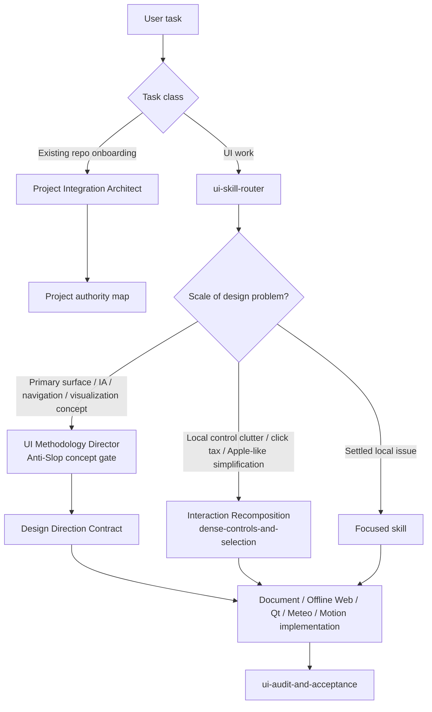

<div align="center">

# AI Agents Skills

**Project-first integration, Anti-Slop macro direction and interaction recomposition for Codex, Claude Code and Google Antigravity**

[](https://github.com/f2re/ai-agents-skills/actions/workflows/validate-skills.yml)

A reusable engineering layer for coding agents: safe repository integration, UI/UX decision systems, document-automation workstations, offline web UI, native Qt/C++, meteorological workstations, Qwt/scientific visualization, motion/direct manipulation and evidence-based acceptance.

</div>

## Why this exists

Coding agents commonly fail at two different levels:

1. **Macro:** they jump from “make it professional” to a generic dashboard/components theme.
2. **Local:** they preserve five individually valid dropdowns/buttons even when those controls together are the wrong interaction model.

This repository treats these as different problems:

- **Anti-Slop concept gate** — redesigns the primary work surface / information architecture.
- **Interaction Recomposition** — rethinks a local cluster of controls around one user intent without invoking a heavy macro-design ceremony.

It also integrates into established repositories without replacing project-owned instructions, design memory, skills or agents.

The library is deliberately multi-domain. Shared interaction principles are reused, while platform/domain skills are selected only for the actual project. A local HTML/CSS/JavaScript document product should not be implemented as Qt merely because Qt skills are present, and a document workflow should not inherit meteorological map/time metaphors merely because the original catalog started there.

## Install

```bash
curl -fsSL https://raw.githubusercontent.com/f2re/ai-agents-skills/main/install.sh | bash
ai-skills doctor
```

For an existing project, inspect before writing:

```bash
ai-skills integrate . --plan
```

Then stage non-destructive integration:

```bash
ai-skills integrate .
```

Vendor non-conflicting skills when the repository should carry them in Git:

```bash
ai-skills integrate . --vendor
```

`ai-skills project .` remains a compatibility alias for `integrate`.

See [`docs/existing-project-integration.md`](docs/existing-project-integration.md) for the authority-map/onboarding details.

## Design routing



`skill-agent-orchestrator` owns multi-area delegation/synthesis. `ui-skill-router` is the single detailed routing authority for focused UI work, avoiding two duplicated routing tables.

## Anti-Slop: macro concept gate

Use when a task changes the primary work surface, information architecture, navigation model or visualization architecture, or the product itself is rejected as generic/AI-looking/dashboard-like.

`anti-slop-ui-direction`:

1. states the operational job and primary work object;
2. creates three interaction/information concepts, not three visual themes;
3. runs genericity, templateability, domain-truth and implementation-reality tests;
4. selects one defining mechanism;
5. emits a Design Direction Contract for downstream implementation.

Do **not** invoke this gate simply because a toolbar has too many dropdowns.

See [`docs/anti-slop-methodology.md`](docs/anti-slop-methodology.md).

## Interaction Recomposition: local control redesign

This is the missing middle layer between “pick the right widget” and “redesign the whole screen”. It lives inside [`dense-controls-and-selection`](.agents/skills/dense-controls-and-selection/SKILL.md), not in another agent/skill.

Trigger it when several controls serve one frequent intent, for example:

```text
Model [▼]  Run [▼]  Lead [▼]  Time [▼]  [<] [>] [Apply]
```

The pass asks:

1. What one user job does this cluster serve?
2. Which values are independent semantic axes?
3. Which are derived metadata or safely inferred?
4. Which are rare overrides that can be contextual?
5. Is direct manipulation natural for an ordered axis?
6. Which standard desktop primitive now expresses the remaining semantics?

A meteorological result might become:

```text
ECMWF 00Z                         +18 h
12:00 ────────●────────────────── 18:00
```

where model/run remain explicit context, valid time is the primary navigation surface, and lead is derived rather than a fourth independent selector.

A document-generation cluster might become:

```text
Шаблон: Приказ о назначении
Получатели: Отдел разработки · 27 человек
Результат: 27 документов

[Проверить и сформировать]
```

where expected count and preflight are derived/status, not extra editable selectors.

The goal is **minimum unnecessary decisions**, not minimum widget count.

### Apple-like, without cargo cult

Current Apple-like interaction craft is used for semantic economy rather than visual imitation:

- tabs for related main-content panes;
- segmented controls for a small set of closely related modes/actions;
- popovers/inspectors for small temporary related controls that should not permanently consume the work surface;
- pop-up/combo for compact mutually-exclusive selection;
- slider/scrubber only for a real ordered range;
- deliberately small logical toolbar groups;
- content-first hierarchy, keyboard/pointer precision and familiar platform behavior.

Do not translate “Apple-like” into glass, pills, huge whitespace or decorative animation.

Worked cases: [`dense-controls-and-selection/references/control-recomposition.md`](.agents/skills/dense-controls-and-selection/references/control-recomposition.md).

## Docomator / document-workstation profile

The Docomator profile reinterprets the reusable patterns around document work rather than renaming meteorological controls.

The defining global route is:

```text
Данные → Шаблон → Выпуск → Результат
```

It is a readiness/navigation spine, not a rigid wizard. Surface-specific mechanisms are:

- **Visual Template Studio:** document canvas + selection-driven contextual inspector;
- **Document generation:** exact composition + revision-bound preflight + correction + persisted result;
- **Extraction/import:** automatic proposal first, focused correction second, explicit mutation last;
- **Results:** attention-ordered operation/result register.

For the current Docomator implementation, the platform skill is [`offline-web-interface-engineering`](.agents/skills/offline-web-interface-engineering/SKILL.md), because the actual product UI is local offline HTML/CSS/JavaScript. `qt-cpp-design-system` remains available for real Qt projects but is not selected for Docomator by default.

The profile preserves critical document truth:

- browser DOM/HTML/CSS is a projection, not persisted Office binding truth;
- template/source/result identity remains explicit in human terms;
- stale preview/preflight cannot remain valid after dependent inputs change;
- extraction errors are structured by row/cell/value/action rather than parsed from localized text;
- read/preview does not silently create data;
- entered corrections and prepared generation context survive recoverable errors;
- runtime remains offline and document/LLM content remains untrusted.

See:

- [`docs/docomator-ui-profile.md`](docs/docomator-ui-profile.md) — full meteo/Qt → document pattern mapping and design direction;
- [`docs/docomator-ui-review-checklist.md`](docs/docomator-ui-review-checklist.md) — document-specific acceptance gate;
- [`anti-slop-ui-direction/references/examples/docomator-document-workbench.md`](.agents/skills/anti-slop-ui-direction/references/examples/docomator-document-workbench.md) — three concept mechanisms and rejection tests.

## Skill catalog

| Area | Skill | Purpose |
|---|---|---|
| Integration | [`existing-project-integration`](.agents/skills/existing-project-integration/SKILL.md) | Existing-project inventory, authority and collision-safe merge |
| Routing | [`skill-agent-orchestrator`](.agents/skills/skill-agent-orchestrator/SKILL.md) | Multi-area delegation/synthesis |
| Routing | [`ui-skill-router`](.agents/skills/ui-skill-router/SKILL.md) | Canonical focused UI routing |
| Concept | [`anti-slop-ui-direction`](.agents/skills/anti-slop-ui-direction/SKILL.md) | Macro concept gate and Design Direction Contract |
| Evidence | [`design-evidence-and-intent`](.agents/skills/design-evidence-and-intent/SKILL.md) | Evidence, intent, constraints |
| Documents | [`document-workstation-ux`](.agents/skills/document-workstation-ux/SKILL.md) | Document route, primary work objects, provenance, fast access and state truth |
| Documents | [`document-template-canvas-and-binding`](.agents/skills/document-template-canvas-and-binding/SKILL.md) | DOCX/XLSX visual canvas, validated selection/binding, repeats and trial |
| Documents | [`document-generation-flow`](.agents/skills/document-generation-flow/SKILL.md) | Audience/output/preflight/correction/launch/partial retry/results |
| Documents | [`document-extraction-and-import-review`](.agents/skills/document-extraction-and-import-review/SKILL.md) | Automatic-first extraction/import, source-linked review and structured repair |
| Offline Web | [`offline-web-interface-engineering`](.agents/skills/offline-web-interface-engineering/SKILL.md) | Semantic local web UI, tokens/CSP/reflow/accessibility/motion |
| Flow | [`interaction-contracts-and-flow`](.agents/skills/interaction-contracts-and-flow/SKILL.md) | Intent → feedback → result/recovery, click tax |
| Controls | [`dense-controls-and-selection`](.agents/skills/dense-controls-and-selection/SKILL.md) | Interaction Recomposition + tabs/segments/combo/popover/slider/scrubber |
| Hierarchy | [`information-hierarchy-and-density`](.agents/skills/information-hierarchy-and-density/SKILL.md) | Density, grouping, persistent vs contextual UI |
| Qt | [`qt-cpp-design-system`](.agents/skills/qt-cpp-design-system/SKILL.md) | Native Qt design system and implementation |
| Workflow | [`workflow-and-progressive-disclosure`](.agents/skills/workflow-and-progressive-disclosure/SKILL.md) | Staged wizard/import/review flows |
| States | [`states-errors-and-recovery`](.agents/skills/states-errors-and-recovery/SKILL.md) | Loading/stale/partial/error/retry/cancel |
| Safety | [`operator-accessibility-and-safety`](.agents/skills/operator-accessibility-and-safety/SKILL.md) | Keyboard/focus/non-color/operator safety |
| Meteorology | [`meteorologist-workstation-ux`](.agents/skills/meteorologist-workstation-ux/SKILL.md) | Workstation semantics |
| Radar | [`radar-timeline-and-playback`](.agents/skills/radar-timeline-and-playback/SKILL.md) | Exact radar/nowcast timeline semantics |
| Time | [`time-data-navigation`](.agents/skills/time-data-navigation/SKILL.md) | Valid time / run / lead navigation |
| Maps | [`viewport-map-interactions`](.agents/skills/viewport-map-interactions/SKILL.md) | Map zoom/pan/LOD/request behavior |
| Plots | [`meteorological-visualization`](.agents/skills/meteorological-visualization/SKILL.md) | Qwt/scientific plots, ensembles, aerology, uncertainty |
| Motion | [`motion-feedback-and-microinteractions`](.agents/skills/motion-feedback-and-microinteractions/SKILL.md) | Purpose/frequency motion across document/Qt/web work |
| Gestures | [`gesture-and-direct-manipulation`](.agents/skills/gesture-and-direct-manipulation/SKILL.md) | Drag/scrub/wheel/snap/direct manipulation |
| Acceptance | [`ui-audit-and-acceptance`](.agents/skills/ui-audit-and-acceptance/SKILL.md) | Flow, control fragmentation, states, document/meteo domain and concept regression |

## Specialist roles

| Agent | Use for |
|---|---|
| [`ai-skills-orchestrator`](agents/ai-skills-orchestrator.md) | Complex multi-area routing and synthesis |
| [`project-integration-architect`](agents/project-integration-architect.md) | Existing-repository onboarding only |
| [`ui-methodology-director`](agents/ui-methodology-director.md) | Macro primary-surface concept direction only |
| [`ui-ux-auditor`](agents/ui-ux-auditor.md) | Existing UI evidence, flow, control fragmentation/recomposition, acceptance |
| [`qt-interface-designer`](agents/qt-interface-designer.md) | Native Qt/C++ implementation |
| [`meteo-workstation-designer`](agents/meteo-workstation-designer.md) | Meteorological operational UX, including time/model control recomposition |
| [`motion-interaction-reviewer`](agents/motion-interaction-reviewer.md) | Gestures, scrub/drag, motion and feedback |

Do not spawn all roles. Document automation uses the focused document skills directly unless an existing auditor/motion/concept specialist adds a bounded independent workstream.

## Platform registration

| Platform | Global skills | Global agents |
|---|---|---|
| Codex | `~/.agents/skills/` | `~/.codex/agents/*.toml` |
| Claude Code | `~/.claude/skills/` | `~/.claude/agents/*.md` |
| Antigravity | `~/.gemini/config/skills/` + compatibility links | `~/.gemini/config/agents/<name>/agent.md` |

Project integration uses a non-destructive authority-map model rather than rewriting root design/instruction files.

## CLI

| Command | Purpose |
|---|---|
| `ai-skills global` | Register global skills/agents |
| `ai-skills integrate [path] --plan` | Read-only project inventory |
| `ai-skills integrate [path]` | Stage safe integration adapter + architect |
| `ai-skills integrate [path] --vendor` | Also vendor non-conflicting skills |
| `ai-skills prompt [path]` | Print repository-aware integration prompt |
| `ai-skills list skills` / `list agents` | Metadata-only catalog |
| `ai-skills doctor` | Validate corpus and registrations |
| `ai-skills update` | Refresh installation |
| `ai-skills uninstall` | Remove package-managed global registrations |

## Core anti-patterns

- one giant designer prompt;
- duplicate routers with diverging UI rules;
- methodology director for a local five-control cleanup;
- fixing multiple dropdowns one by one without cluster recomposition;
- exposing backend decomposition as user interaction;
- derived state offered as another selector;
- slider for arbitrary categories;
- tabs/segmented controls chosen for appearance rather than semantics;
- permanent secondary panels consuming the primary work surface;
- global spinners for local async work;
- hiding domain provenance to make UI visually minimal;
- Apple-like interpreted as glass/pills/whitespace;
- routing a local offline web product to Qt because the catalog contains Qt skills;
- treating browser DOM/pixels as persisted DOCX/XLSX binding truth;
- preserving stale preflight after template/audience/data changes;
- rebuilding structured import errors by regexp from localized text;
- decorative document animation that delays frequent work;
- installing framework roles over established project-local authority.

See [`docs/patterns-and-antipatterns.md`](docs/patterns-and-antipatterns.md).

## Validation

GitHub Actions checks skill structure, the Docomator document-workstation profile, canonical agent-name parity across Codex/Claude/Antigravity, required recomposition registrations, non-destructive project integration, vendor collision handling and the real bootstrap path.

Run locally:

```bash
bash scripts/validate-skills.sh
bash scripts/validate-docomator-profile.sh
bash scripts/validate-package.sh
```

## Research

Research and adaptation notes: [`docs/source-research.md`](docs/source-research.md). Sources include TrueSpace Anti-Slop, Apple Human Interface Guidelines, UI Skills, design-system references and interaction/motion engineering material.

---

**Build around the user's work object. Remove interaction machinery that exists only because the backend has fields. Preserve domain truth even when the UI becomes quieter.**
