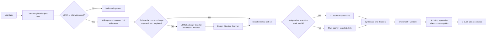
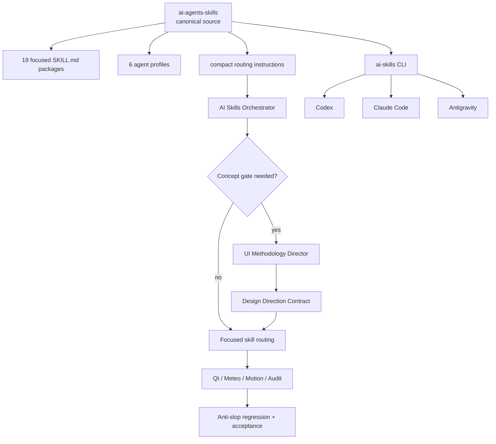

<div align="center">

# AI Agents Skills

**Progressive-disclosure skills, Anti-Slop concept direction and specialist agents for Codex, Claude Code and Google Antigravity**

[](https://github.com/f2re/ai-agents-skills/actions/workflows/validate-skills.yml)
[](https://github.com/f2re/ai-agents-skills/stargazers)
[](https://github.com/f2re/ai-agents-skills/network/members)
[](https://github.com/f2re/ai-agents-skills/commits/main)
[](https://github.com/f2re/ai-agents-skills/issues)


A reusable engineering layer for coding agents: concept direction, UI/UX contracts, Qt/C++ rules, meteorological workstation patterns, radar timelines, maps, scientific visualization, motion, direct manipulation and evidence-based acceptance.

[Install](#-one-command-install) · [Routing](#-how-orchestration-works) · [Anti-Slop](#-anti-slop-methodology) · [Skills](#-skill-catalog) · [Agents](#-specialist-agents) · [Architecture](#-architecture)

</div>

---

## Why this exists

Coding agents often know how to produce components but not **what interaction concept should organize the user's work**. They tend to jump from a vague request like “make it professional” directly to cards, sidebars, gradients, dropdowns and generic plots. The result can be clean and still be interchangeable with a finance/SaaS dashboard.

This repository turns UI/UX judgment into inspectable engineering rules. Material design work follows:

**user intent → concept gate → focused skills → optional specialist agents → implementation → anti-slop regression → acceptance audit**.

Skills are discovered by name and description first; their full instructions and optional references are loaded only when relevant. A small fix does not pay the cost of a full design ceremony.

The current catalog is especially detailed for **native Qt/C++ meteorological software**: radar/satellite time navigation, forecast cycles, map LOD, asynchronous data loading, Qwt/scientific plots, uncertainty, keyboard-first operation and dense-but-readable professional layouts.

## ⚡ One-command install

```bash
curl -fsSL https://raw.githubusercontent.com/f2re/ai-agents-skills/main/install.sh | bash
```

No `sudo` is required. The bootstrap downloads one managed source copy, installs the `ai-skills` CLI, registers global skills and specialist agents, and adds a small managed orchestration block to each supported coding-agent environment.

Then verify and integrate a project:

```bash
ai-skills doctor
ai-skills status
ai-skills project .
```

Or install + integrate in one command:

```bash
curl -fsSL https://raw.githubusercontent.com/f2re/ai-agents-skills/main/install.sh | bash -s -- --project .
```

<details>
<summary><strong>Team / vendored mode</strong></summary>

```bash
ai-skills project . --vendor
```

This copies the skill catalog into project-scoped locations so teammates/CI receive the same corpus from Git. Existing non-managed files are not overwritten.

</details>

<details>
<summary><strong>Update / uninstall</strong></summary>

```bash
ai-skills update
ai-skills uninstall
```

`uninstall` removes registrations created by this package and its managed instruction blocks. It does not delete unrelated user instructions.

</details>

## 🧠 How orchestration works

The central rule is **progressive disclosure, not prompt dumping**. Anti-slop is also progressive: it runs only when the product concept is actually changing.



Routing rules:

- a small or obvious edit stays with the main agent;
- a single concern activates one focused skill;
- a substantial primary work-surface/information/navigation/visualization redesign runs the concept gate first;
- “looks generic / AI-generated / dashboard-like / slop” is treated as a conceptual signal, not a request to merely change colors or radii;
- the methodology director is normally sequential; downstream implementation specialists share one accepted concept;
- complex work may use 2–4 **independent** specialists, especially for read-heavy analysis;
- overlapping write-heavy agents are avoided;
- `DESIGN.md` is consulted only for relevant product/UI work.

## 🧭 Anti-Slop methodology

Anti-slop here is **not a visual style**. It is a rejection and handoff system.

Before implementation of a substantial surface, `anti-slop-ui-direction`:

1. states the user's operational question and primary work object;
2. creates three concepts that differ in interaction/information mechanism, not theme/layout;
3. runs four tests: **genericity**, **templateability**, **domain truth**, **implementation reality**;
4. selects one defining mechanism plus at most one or two supports;
5. emits a compact **Design Direction Contract** with invariants, non-goals and downstream routing.

Examples of mechanisms for meteorological software include `TIME IS THE SPINE`, `ATMOSPHERIC COLUMN IS THE OBJECT`, `MODEL DISAGREEMENT IS DATA`, `FACT → NOW → FORECAST`, `MAP ↔ PLOT COUPLING` and `LINKED INSPECTION`.

The genericity test is scoped deliberately. A normal `QDialog`, `QTableView`, toolbar or combo box may remain conventional. The test targets the **primary work surface and organizing logic**: if temperature/model/station data can be relabeled as revenue/region/customer and the same main screen still makes equal sense, the product concept is probably generic.

Constraints are classified as `FORBIDDEN`, `REJECT BY DEFAULT` and `ALLOW WITH JUSTIFICATION`; cards/animation/gradients are not cargo-cult bans.

See [`docs/anti-slop-methodology.md`](docs/anti-slop-methodology.md) and the optional reference corpus under [`anti-slop-ui-direction/references`](.agents/skills/anti-slop-ui-direction/references/).

## 🧩 Skill catalog

Every skill contains explicit when-to-use rules, patterns, anti-patterns and acceptance criteria.

| Area | Skill | What it does |
|---|---|---|
| Routing | [`skill-agent-orchestrator`](.agents/skills/skill-agent-orchestrator/SKILL.md) | Chooses the smallest relevant skill set and optional specialists. |
| Routing | [`ui-skill-router`](.agents/skills/ui-skill-router/SKILL.md) | Routes focused UI tasks without loading the full catalog. |
| Concept | [`anti-slop-ui-direction`](.agents/skills/anti-slop-ui-direction/SKILL.md) | Concept gate, rejection tests, Design Direction Contract and regression rules. |
| Evidence | [`design-evidence-and-intent`](.agents/skills/design-evidence-and-intent/SKILL.md) | Separates observed evidence, intent, constraints and preference. |
| Flow | [`interaction-contracts-and-flow`](.agents/skills/interaction-contracts-and-flow/SKILL.md) | `intent → trigger → feedback → pending → result → recovery → next action`. |
| Hierarchy | [`information-hierarchy-and-density`](.agents/skills/information-hierarchy-and-density/SKILL.md) | Grouping, spacing, density, hierarchy and progressive disclosure. |
| Qt/C++ | [`qt-cpp-design-system`](.agents/skills/qt-cpp-design-system/SKILL.md) | Native Qt Widgets/QML/C++ design-system rules. |
| Controls | [`dense-controls-and-selection`](.agents/skills/dense-controls-and-selection/SKILL.md) | Combo/search/multi-select/segmented controls and compact toolbars. |
| Workflows | [`workflow-and-progressive-disclosure`](.agents/skills/workflow-and-progressive-disclosure/SKILL.md) | Wizards, import/review flows and staged disclosure. |
| States | [`states-errors-and-recovery`](.agents/skills/states-errors-and-recovery/SKILL.md) | Loading, empty, stale, partial, error, retry and cancel. |
| Safety | [`operator-accessibility-and-safety`](.agents/skills/operator-accessibility-and-safety/SKILL.md) | Keyboard/focus, non-color cues and operator safety. |
| Meteorology | [`meteorologist-workstation-ux`](.agents/skills/meteorologist-workstation-ux/SKILL.md) | Workstation semantics around time, model, source and uncertainty. |
| Radar | [`radar-timeline-and-playback`](.agents/skills/radar-timeline-and-playback/SKILL.md) | Compact radar/satellite/nowcast timeline and per-frame states. |
| Time | [`time-data-navigation`](.agents/skills/time-data-navigation/SKILL.md) | Forecast cycles, valid-time navigation and temporal context. |
| Maps | [`viewport-map-interactions`](.agents/skills/viewport-map-interactions/SKILL.md) | Predictable zoom/pan, semantic LOD and request behavior. |
| Plots | [`meteorological-visualization`](.agents/skills/meteorological-visualization/SKILL.md) | Scientific plots, crosshair, ensembles, aerology and uncertainty. |
| Motion | [`motion-feedback-and-microinteractions`](.agents/skills/motion-feedback-and-microinteractions/SKILL.md) | Purpose/frequency-first motion and interruptibility. |
| Gestures | [`gesture-and-direct-manipulation`](.agents/skills/gesture-and-direct-manipulation/SKILL.md) | Mouse/trackpad/wheel/drag/snap semantics. |
| Acceptance | [`ui-audit-and-acceptance`](.agents/skills/ui-audit-and-acceptance/SKILL.md) | Final evidence-based audit plus concept-regression gate. |

### Example: SLOP → DECENT → PROFESSIONAL radar timeline

**SLOP:** generic slider + global spinner + observed/forecast frames that look identical.

**DECENT:** compact exact timestamps, play/pause and local loading.

**PROFESSIONAL:** `FACT → NOW → FORECAST` is the defining mechanism; provenance is part of the timeline, every frame carries loaded/pending/missing state, the last valid map stays visible during refresh, gaps remain honest and keyboard stepping is immediate.

See [`radar-timeline-and-playback`](.agents/skills/radar-timeline-and-playback/SKILL.md) and the anti-slop [`radar-timeline` reference](.agents/skills/anti-slop-ui-direction/references/examples/radar-timeline.md).

## 🤖 Specialist agents

Specialists are **compositions**, not copies of the whole skill corpus.

| Agent | Best used for | Definition |
|---|---|---|
| **AI Skills Orchestrator** | Multi-area work; routing, delegation and synthesis | [`agents/ai-skills-orchestrator.md`](agents/ai-skills-orchestrator.md) |
| **UI Methodology Director** | Substantial concept direction, anti-slop tests, Design Direction Contract | [`agents/ui-methodology-director.md`](agents/ui-methodology-director.md) |
| **UI/UX Auditor** | Existing-interface evidence, click tax, states, hierarchy and acceptance | [`agents/ui-ux-auditor.md`](agents/ui-ux-auditor.md) |
| **Qt Interface Designer** | Native Qt/C++ architecture and implementation | [`agents/qt-interface-designer.md`](agents/qt-interface-designer.md) |
| **Meteo Workstation Designer** | Radar, forecast cycles, maps, timelines and scientific visualization | [`agents/meteo-workstation-designer.md`](agents/meteo-workstation-designer.md) |
| **Motion Interaction Reviewer** | Gesture semantics, motion purpose/frequency/interruption | [`agents/motion-interaction-reviewer.md`](agents/motion-interaction-reviewer.md) |

Native registration templates live under [`integrations/`](integrations/).

## 🔌 Platform registration

`ai-skills global` registers the same source catalog through native discovery mechanisms.

| Platform | Global skills | Global agents | Compact global rules |
|---|---|---|---|
| **Codex** | `~/.agents/skills/` | `~/.codex/agents/*.toml` | `~/.codex/AGENTS.md` |
| **Claude Code** | `~/.claude/skills/` | `~/.claude/agents/*.md` | `~/.claude/CLAUDE.md` |
| **Antigravity** | `~/.gemini/config/skills/` plus compatibility links | `~/.gemini/config/agents/<name>/agent.md` | `~/.gemini/GEMINI.md` |

The source is kept once under `~/.local/share/ai-agents-skills` by default and supported global skill locations point to it with symlinks.

> Antigravity currently exposes several skill locations across surfaces/releases. Registration covers `~/.gemini/config/skills`, `~/.gemini/antigravity/skills`, and `~/.gemini/antigravity-cli/skills`; workspace integration uses `.agents/skills`.

See [`docs/installation-and-registration.md`](docs/installation-and-registration.md).

## 🏗️ Project integration

```bash
ai-skills project .
```

adds/updates only marked AI Agents Skills blocks and platform agent definitions:

```text
project/
├── AGENTS.md
├── CLAUDE.md
├── GEMINI.md
├── DESIGN.md
├── .codex/agents/
├── .claude/agents/
└── .agents/agents/
```

With `--vendor`, project-scoped skills are also copied into `.agents/skills/` and `.claude/skills/`.

### What belongs in `DESIGN.md`?

Not a giant style prompt. It records durable project facts:

- users and high-frequency jobs;
- accepted **defining operational idea** and primary work object for major work surfaces;
- anti-slop/domain invariants and non-goals;
- information hierarchy and always-visible context;
- interaction contracts;
- loading/stale/partial/error behavior;
- keyboard/navigation decisions;
- motion constraints;
- domain semantics such as units, valid time, source/model/cycle;
- dated product decisions and explicit exceptions.

Rejected concept brainstorming stays out of project memory.

## 🗺️ Architecture



### Context strategy

```mermaid
sequenceDiagram
    participant U as User
    participant P as Parent agent
    participant D as Methodology director
    participant S as Focused skills
    participant I as Implementation specialist

    U->>P: Redesign model comparison; it looks like AI dashboard
    P->>D: bounded concept question
    D-->>P: Design Direction Contract: MODEL DISAGREEMENT IS DATA
    P->>S: load meteo visualization + time + Qt rules only
    P->>I: implement contract and invariants
    I-->>P: patch / implementation evidence
    P->>S: anti-slop regression + ui-audit-and-acceptance
    P-->>U: one coherent result
```

## 🚫 Core anti-patterns

The system rejects both interaction defects and common design-process failures:

- loading every skill “just in case”;
- one giant designer prompt for every UI task;
- spawning specialists for trivial edits;
- calling palette/sidebar/card choices a “concept”;
- generating three cosmetically different versions of the same architecture;
- solving “generic AI dashboard” complaints with only borders, colors, radii or typography;
- forcing novelty into standard Qt dialogs/controls;
- using a dropdown for a frequent binary switch;
- hiding high-frequency actions behind unnecessary clicks;
- permanent panels for rare controls;
- global spinners for local asynchronous work;
- blanking valid radar/map data during refresh;
- collapsing missing timestamps and falsifying continuity;
- exposing internal model IDs instead of operator semantics;
- animating repeated keyboard/time navigation;
- letting implementation silently erase an accepted Design Direction Contract;
- reporting raw specialist outputs instead of one integrated decision.

See [`docs/patterns-and-antipatterns.md`](docs/patterns-and-antipatterns.md).

## 🛠️ CLI

| Command | Purpose |
|---|---|
| `ai-skills global` | Register global skills, agents and compact orchestration rules. |
| `ai-skills project [path]` | Add project routing + specialists + `DESIGN.md`. |
| `ai-skills project [path] --vendor` | Also copy skills into project discovery directories. |
| `ai-skills list skills` | Show skill metadata without opening bodies. |
| `ai-skills list agents` | Show specialist agent metadata. |
| `ai-skills status` | Show source and registration locations. |
| `ai-skills doctor` | Validate corpus and installed registrations. |
| `ai-skills update` | Refresh from `main` and re-register. |
| `ai-skills uninstall` | Remove managed registrations safely. |

## 📚 Research basis

Rules are distilled from coding-agent conventions and design-engineering references rather than copied visual components. The Anti-Slop layer adapts TrueSpace's decision-system idea — multiple idea-level concepts, generic/template rejection and a defining mechanism — while explicitly **not** importing its poster visual style into professional desktop UI.

Research notes: [`docs/source-research.md`](docs/source-research.md).

## ✅ Validation

GitHub Actions checks:

- skill YAML frontmatter and directory/name consistency;
- explicit anti-pattern coverage;
- shell syntax;
- all 6 platform agent templates;
- anti-slop skill registration across Codex/Claude/Antigravity;
- methodology-director global and project registration;
- sandboxed global/project/vendored installation;
- managed-block idempotence.

Run locally:

```bash
bash scripts/validate-skills.sh
bash scripts/validate-package.sh
```

## ⭐ Star history

If this catalog helps agents produce less generic and more operationally correct interfaces, a star makes the project easier to discover.

[](https://star-history.com/#f2re/ai-agents-skills&Date)

---

<div align="center">

**Build interfaces from user intent and domain mechanisms, not from component autocomplete.**

</div>
