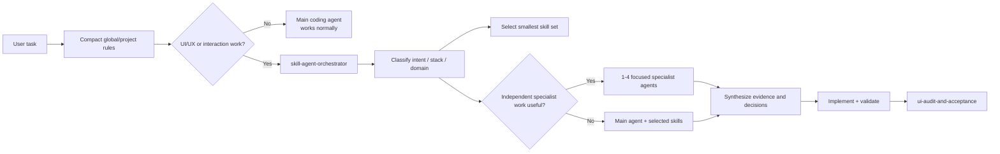
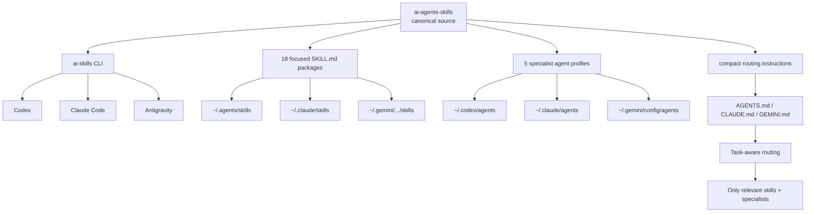
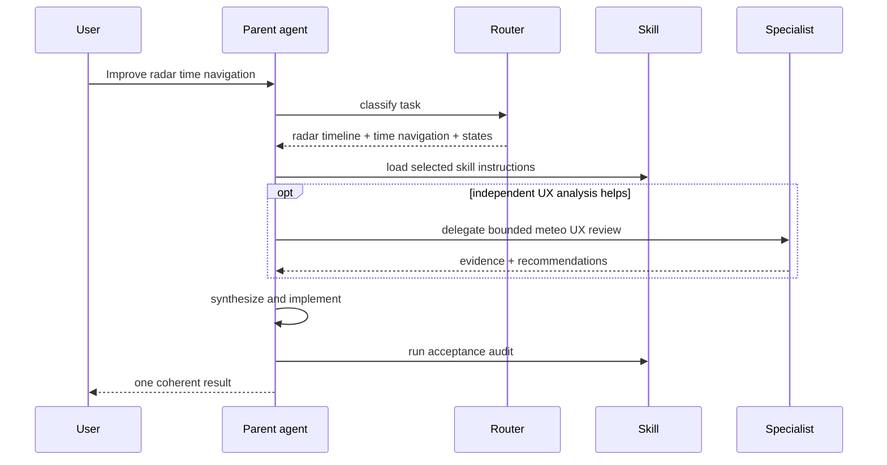

<div align="center">

# AI Agents Skills

**Progressive-disclosure skills and specialist agents for Codex, Claude Code and Google Antigravity**

[](https://github.com/f2re/ai-agents-skills/actions/workflows/validate-skills.yml)
[](https://github.com/f2re/ai-agents-skills/stargazers)
[](https://github.com/f2re/ai-agents-skills/network/members)
[](https://github.com/f2re/ai-agents-skills/commits/main)
[](https://github.com/f2re/ai-agents-skills/issues)


A reusable engineering layer for coding agents: UI/UX contracts, Qt/C++ interface rules, meteorological workstation patterns, radar timelines, maps, scientific visualization, motion, direct manipulation and evidence-based review.

[Install](#-one-command-install) · [Routing](#-how-orchestration-works) · [Skills](#-skill-catalog) · [Agents](#-specialist-agents) · [Project integration](#-project-integration) · [Architecture](#-architecture)

</div>

---

## Why this exists

Coding agents often know how to produce a component, but not **when that component belongs in the user's workflow**. They also tend to over-load context with broad design instructions, overuse cards and dropdowns, hide state changes, animate frequent actions, and treat professional operator software like a marketing page.

This repository turns UI/UX judgment into inspectable engineering rules. A task is routed from **user intent → interaction contract → relevant skills → optional specialist agent → implementation → acceptance audit**. Skills are discovered by name and description first; their full instructions are loaded only when relevant.

The current catalog is especially detailed for **native Qt/C++ meteorological software**: radar/satellite time navigation, forecast cycles, map LOD, asynchronous data loading, scientific plots, uncertainty, keyboard-first operation and dense-but-readable professional layouts.

## ⚡ One-command install

```bash
curl -fsSL https://raw.githubusercontent.com/f2re/ai-agents-skills/main/install.sh | bash
```

No `sudo` is required. The bootstrap downloads one managed source copy, installs the `ai-skills` CLI, registers global skills and specialist agents, and adds a small managed orchestration block to each supported coding-agent environment.

Then verify:

```bash
ai-skills doctor
ai-skills status
```

Integrate the current repository as well:

```bash
ai-skills project .
```

Or do both in one command:

```bash
curl -fsSL https://raw.githubusercontent.com/f2re/ai-agents-skills/main/install.sh | bash -s -- --project .
```

<details>
<summary><strong>Team / vendored mode</strong></summary>

For a repository that should carry its own skills and agents in Git:

```bash
ai-skills project . --vendor
```

This copies the skill catalog into project-scoped locations instead of depending only on the developer's global installation. Existing non-managed files are not overwritten.

</details>

<details>
<summary><strong>Update / uninstall</strong></summary>

```bash
ai-skills update
ai-skills uninstall
```

`uninstall` removes registrations created by this package and its managed instruction blocks. It does not delete unrelated user instructions.

</details>

## 🧠 How orchestration works

The central rule is **progressive disclosure, not prompt dumping**. The main coding agent can see catalog metadata, but it does not read every `SKILL.md` and does not spawn every specialist.



Routing rules:

- a small or obvious edit stays with the main agent;
- a single concern activates one focused skill;
- a medium task may use one specialist;
- a complex task may use 2–4 **independent** specialists, especially for read-heavy analysis;
- overlapping write-heavy agents are avoided;
- specialists return evidence and bounded recommendations; the parent agent owns integration;
- `DESIGN.md` is consulted for relevant product/UI work, not automatically injected into unrelated backend tasks.

This preserves context for the actual code while still giving the agent deep design guidance when it matters.

## 🧩 Skill catalog

Every skill contains explicit **when-to-use rules, patterns, anti-patterns and acceptance criteria**. Click a skill to inspect the full instructions.

| Area | Skill | What it does |
|---|---|---|
| Routing | [`skill-agent-orchestrator`](.agents/skills/skill-agent-orchestrator/SKILL.md) | Chooses the smallest relevant skill set and decides whether specialist delegation is justified. |
| Routing | [`ui-skill-router`](.agents/skills/ui-skill-router/SKILL.md) | Routes focused UI tasks without loading the whole UI catalog. |
| Evidence | [`design-evidence-and-intent`](.agents/skills/design-evidence-and-intent/SKILL.md) | Separates observed evidence, user intent, product constraints and subjective preference. |
| Flow | [`interaction-contracts-and-flow`](.agents/skills/interaction-contracts-and-flow/SKILL.md) | Audits `intent → trigger → feedback → pending → result → recovery → next action`. |
| Hierarchy | [`information-hierarchy-and-density`](.agents/skills/information-hierarchy-and-density/SKILL.md) | Controls visual hierarchy, grouping, spacing, density and progressive disclosure. |
| Qt/C++ | [`qt-cpp-design-system`](.agents/skills/qt-cpp-design-system/SKILL.md) | Maps design-system principles to native Qt Widgets/QML/C++ primitives and tokens. |
| Controls | [`dense-controls-and-selection`](.agents/skills/dense-controls-and-selection/SKILL.md) | Correct use of combo/search/multi-select/segmented controls, filters and compact toolbars. |
| Workflows | [`workflow-and-progressive-disclosure`](.agents/skills/workflow-and-progressive-disclosure/SKILL.md) | Wizards, import/review flows, adaptive disclosure and complex multi-step tasks. |
| States | [`states-errors-and-recovery`](.agents/skills/states-errors-and-recovery/SKILL.md) | Loading, empty, stale, partial, error, retry, cancellation and recovery behavior. |
| Safety | [`operator-accessibility-and-safety`](.agents/skills/operator-accessibility-and-safety/SKILL.md) | Keyboard/focus, contrast, non-color cues and protection from operator mistakes. |
| Meteorology | [`meteorologist-workstation-ux`](.agents/skills/meteorologist-workstation-ux/SKILL.md) | Structures a meteorologist workstation around valid time, cycle, model, source and uncertainty. |
| Radar | [`radar-timeline-and-playback`](.agents/skills/radar-timeline-and-playback/SKILL.md) | Compact radar/satellite/nowcast timeline with exact timestamps, per-frame loading and playback. |
| Time | [`time-data-navigation`](.agents/skills/time-data-navigation/SKILL.md) | Forecast cycles, valid-time navigation, adaptive stepping and temporal context preservation. |
| Maps | [`viewport-map-interactions`](.agents/skills/viewport-map-interactions/SKILL.md) | Predictable map zoom/pan, semantic LOD, request coalescing and context-preserving navigation. |
| Plots | [`meteorological-visualization`](.agents/skills/meteorological-visualization/SKILL.md) | Scientific plots, crosshair, units, ensembles, aerology and uncertainty. |
| Motion | [`motion-feedback-and-microinteractions`](.agents/skills/motion-feedback-and-microinteractions/SKILL.md) | Purpose/frequency-first motion, duration/easing, feedback and interruptibility. |
| Gestures | [`gesture-and-direct-manipulation`](.agents/skills/gesture-and-direct-manipulation/SKILL.md) | Mouse, wheel, trackpad, drag/swipe, snap/bounds and direct-manipulation semantics. |
| Acceptance | [`ui-audit-and-acceptance`](.agents/skills/ui-audit-and-acceptance/SKILL.md) | Final evidence-based UI/UX acceptance audit with prioritized findings. |

### Example: radar timeline contract

The radar timeline skill treats the timeline as an **operator navigation primitive**, not a decorative chart:

```text
[◀]  18:10  18:20  18:30  18:40  18:50  [19:00]  19:10  19:20  [▶]
                                              ↑ selected / loading locally
```

It stays compact, labels valid times explicitly, preserves temporal gaps, distinguishes fact/nowcast/forecast, keeps the last valid frame visible while another term loads, cancels stale requests, prefetches adjacent frames and provides keyboard/playback paths.

See [`radar-timeline-and-playback`](.agents/skills/radar-timeline-and-playback/SKILL.md).

## 🤖 Specialist agents

Specialists are **compositions**, not a second copy of the skill corpus. Their descriptions make them discoverable; they activate only relevant skills while working.

| Agent | Best used for | Definition |
|---|---|---|
| **AI Skills Orchestrator** | Multi-area UI/UX tasks; chooses specialists and integrates results | [`agents/ai-skills-orchestrator.md`](agents/ai-skills-orchestrator.md) |
| **UI/UX Auditor** | Existing-interface evidence, click tax, states, hierarchy and acceptance | [`agents/ui-ux-auditor.md`](agents/ui-ux-auditor.md) |
| **Qt Interface Designer** | Native Qt/C++ architecture, controls, density and interaction implementation | [`agents/qt-interface-designer.md`](agents/qt-interface-designer.md) |
| **Meteo Workstation Designer** | Radar, satellite, forecast cycles, maps, timelines and scientific visualization | [`agents/meteo-workstation-designer.md`](agents/meteo-workstation-designer.md) |
| **Motion Interaction Reviewer** | Gesture semantics, motion purpose, frequency and interruption | [`agents/motion-interaction-reviewer.md`](agents/motion-interaction-reviewer.md) |

Native registration templates live under [`integrations/`](integrations/).

## 🔌 Platform registration

`ai-skills global` registers the same source catalog through the native discovery mechanisms of each tool.

| Platform | Global skills | Global agents | Compact global rules |
|---|---|---|---|
| **Codex** | `~/.agents/skills/` | `~/.codex/agents/*.toml` | `~/.codex/AGENTS.md` |
| **Claude Code** | `~/.claude/skills/` | `~/.claude/agents/*.md` | `~/.claude/CLAUDE.md` |
| **Antigravity** | `~/.gemini/config/skills/` plus compatibility links | `~/.gemini/config/agents/<name>/agent.md` | `~/.gemini/GEMINI.md` |

The install source is kept once under `~/.local/share/ai-agents-skills` by default and supported global skill locations point to it with symlinks. This avoids maintaining divergent copies.

> Antigravity documentation currently exposes different global skill locations for different surfaces/releases (`~/.gemini/config/skills`, `~/.gemini/antigravity/skills`, and `~/.gemini/antigravity-cli/skills`). The installer registers compatibility links for all documented variants while workspace integration uses the stable `.agents/skills` convention.

See [installation and registration details](docs/installation-and-registration.md).

## 🏗️ Project integration

Running:

```bash
ai-skills project .
```

adds/updates only a marked AI Agents Skills block in project instruction files and installs platform-specific agent definitions:

```text
project/
├── AGENTS.md                  # Codex / shared project rules
├── CLAUDE.md                  # Claude Code project rules
├── GEMINI.md                  # Antigravity project rules
├── DESIGN.md                  # product/UI interaction contract
├── .codex/agents/             # Codex specialists
├── .claude/agents/            # Claude specialists
└── .agents/agents/            # Antigravity specialists
```

With `--vendor`, project-scoped skills are also copied into `.agents/skills/` and `.claude/skills/` so the repository is self-contained for the team.

### What goes into `DESIGN.md`?

Not a giant style prompt. It records durable project-specific facts that generic skills cannot know:

- primary users and high-frequency jobs;
- information hierarchy and always-visible context;
- interaction contracts for core actions;
- loading/stale/partial/error behavior;
- keyboard/navigation decisions;
- motion constraints;
- domain semantics such as units, valid time, source/model/cycle;
- dated product decisions and explicit exceptions.

The orchestrator reads it only when the current work actually involves interface behavior or product design.

## 🗺️ Architecture



### Context strategy



## 🚫 Core anti-patterns

The system explicitly rejects patterns coding agents commonly produce without design supervision:

- loading every skill into context “just in case”;
- spawning specialists for trivial edits;
- using a dropdown for a frequent binary switch;
- hiding high-frequency actions behind two or more clicks;
- turning every group into a large card;
- permanent panels for secondary/rare controls;
- global spinners for a local asynchronous operation;
- blanking a radar/map view while the next term loads;
- showing “Loading…” without identifying which data/time is pending;
- collapsing missing timestamps and therefore falsifying temporal continuity;
- using internal model IDs/centers when the operator needs human-readable semantics;
- animating repeated keyboard/time navigation and adding interaction latency;
- changing map scale, time and product semantics in one ambiguous gesture;
- reporting raw specialist outputs instead of one integrated decision.

The growing registry is in [`docs/patterns-and-antipatterns.md`](docs/patterns-and-antipatterns.md).

## 🛠️ CLI

| Command | Purpose |
|---|---|
| `ai-skills global` | Register global skills, agents and compact orchestration rules. |
| `ai-skills project [path]` | Add project routing + specialists + `DESIGN.md`. |
| `ai-skills project [path] --vendor` | Also copy skills into project-scoped discovery directories. |
| `ai-skills list skills` | Show skill names/descriptions without opening the bodies. |
| `ai-skills list agents` | Show specialist agent names/descriptions. |
| `ai-skills status` | Show source and registration locations. |
| `ai-skills doctor` | Validate the skill corpus and installed registrations. |
| `ai-skills update` | Refresh from `main` and re-register. |
| `ai-skills uninstall` | Remove managed registrations without touching unrelated user content. |

See [`docs/orchestration.md`](docs/orchestration.md) for the routing/delegation model.

## 📚 Research basis

The rules are distilled from current coding-agent conventions and design-engineering references rather than copied visual components. Research notes and adaptation decisions are documented in [`docs/source-research.md`](docs/source-research.md).

Key sources include shadcn/ui, coss, Design System Checklist, Beautiful UI, beUI, Rare UI, Transitions.dev, Emil Kowalski's interaction writing, ui-skills.com and Enzo Mangano's gesture/animation demos.

## ✅ Validation

Every change is checked by GitHub Actions. CI validates:

- skill YAML frontmatter and directory/name consistency;
- explicit anti-pattern coverage;
- bootstrap and CLI shell syntax;
- platform agent template structure;
- a sandboxed global registration smoke test;
- a sandboxed project-integration smoke test.

Run locally:

```bash
bash scripts/validate-skills.sh
bash scripts/validate-package.sh
```

## ⭐ Star history

If this catalog helps your agents produce less generic and more operationally correct interfaces, a star makes the project easier to discover.

[](https://star-history.com/#f2re/ai-agents-skills&Date)

---

<div align="center">

**Build interfaces from user intent, not from component autocomplete.**

</div>
